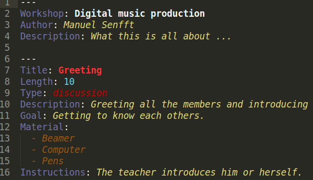

# Workshop Plan

This is an approach for some kind of plain text syntax for planning workshops, seminars, tutorials, training lessons, etc. I tried to put this all into a Sublime Text plugin with syntax highlighting, analyzing output as a sublime popup message and also the ability to export the overall plan into another format like HTML or PDF.

The syntax highlighting can look like this:



## Installation

To install the plugin, clone the repo to a new folder like this: `[SUBLIME_FOLDER]/Packages/WorkshopPlan`. An install with the `Package Control` is not possible yet, since I am not sure how to do this. Help is appreciated here!

After cloning you should set up a key binding like this:

```JSON
	{ "keys": ["alt+e"], "command": "workshopplan" },
```

And now when pressing `Alt+E` the plugin starts.

## Usage

The syntax should like something like this:

```
TITLE
	ELEMENT
		Text is this
		- This would be an item
```

So the start of a block is at the line beginning. The next line should start with a `tab` to declare an element name. There are two internal element captions, which are mandatory to get results from the analyze functions: `Time` and `Material`. After the elements caption there should be a new line and `two tabs`. Here are two options (better do NOT mix both of them!): either simple `text` by just writing, or `lists` by using a minus (`-`) at the start of each new line (while this new line should always have two tabs!). For the internal element types `Time` and `Material` the text or list items should be a simple number for `Time` (declaring the minutes of the block) and an `item list` for the `Materials`. A simple block could look like this then:

```
Example
	Time
		10
	Material
		- Computer
		- Paper
		- Pens
```

This would create a block with the duratin of 10 minutes and these needed materials: "Computer", "Paper" and "Pens".

An example `.wplan` file is [here](documentation/example.wplan).

## To do

- Making `Types` easy accessible.
- Export into HTML and / or PDF
